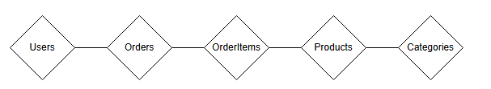

# Database Eksamen —(E-Handel)
Polyglot Description branch = `main`

Polyglot Application branch = `polyglot`

Opgavebeskrivelse I PDF: **Database Eksamen 2025 E-Handel.pdf**

# E-Handel – Polyglot Persistence Detailhandelssystem

## Kursus: SOFT2025 – Databaseteknologier (Forår-Sommer 2025)
**Forfatter:** Andreas & Oliver

---

## 📖 Indholdsfortegnelse

1. Projektoversigt  
2. Funktionelle og Ikke-funktionelle krav  
3. Arkitektur og Teknologistak  
4. Datamodeller og Skemaer  
5. Datakilder  
6. Implementering og Funktioner  
7. Testscenarier  

---

## 1. Projektoversigt

**ShopSmart** er en kommandolinjebaseret e-handelsplatform, udviklet for at demonstrere **polyglot persistence** — brugen af flere forskellige databasetyper til effektiv håndtering af strukturerede, semi-strukturerede og realtidsdata.

---

## 2. Funktionelle og Ikke-funktionelle krav

### Funktionelle krav:
- Visning af produkter og kategorier  
- Visning af tekniske specifikationer og anmeldelser  
- Tilføjelse til kurv og betaling  
- Visning af tidligere ordrer  

### Ikke-funktionelle krav:
- Brug af mindst 3 databaser (SQL, NoSQL, Redis)  
- Brug af rigtige datasæt fra Kaggle  
- Skal kunne køre i et Docker Compose-miljø

---

## 3. Arkitektur & Teknologi
├── SQL Server: Users, Orders, Products

├── MongoDB: Specs & Reviews

└── Redis: Shopping cart per session

| Komponent         | Teknologi           |
|-------------------|---------------------|
| Relationel DB     | SQL Server 2022     |
| Dokument DB       | MongoDB 6.0         |
| KEy-Value Store   | Redis 7             |
| Scripting         | Python 3.10         |
| Orkestrering      | Docker Compose      |
| Brugerflade       | CLI (Python)        |

## 4. Datamodeller

### ERD – SQL Server

**Entiteter:**
- `User(UserID, Name, Email, Password, Role)`
- `Category(CategoryID, CategoryName)`
- `Product(ProductID, ProductName, Price, Brand, Stock, CategoryID)`
- `Order(OrderID, UserID, OrderDate, Total)`
- `OrderItem(OrderItemID, OrderID, ProductID, Quantity, PriceAtPurchase)`

### MongoDB
- `specs`: `{ productId: <string>, specs: { ... } }`
- `reviews`: `{ productId, username, rating, reviewTitle, reviewText }`

### Redis
- `cart:<user_id>` → `{ "<product_id>": quantity, ... }`

---

## 5. Datakilder

- **Produktdatasæt**: Kaggle e-commerce datasæt (Link: https://www.kaggle.com/datasets/karkavelrajaj/amazon-sales-dataset?select=amazon.csv)
- **Anmeldelser**: Renset og konverteret til JSON  
- Importeret via manuelle scripts eller MongoDB Compass

---

## 6. Implementerings

| Fase         | Udført Arbejde                                            |
|--------------|------------------------------------------------------------|
| SQL Server   | Skema + real data + SQL-logik (join, filter, insert)       |
| MongoDB      | Opslag af anmeldelser/specs + kobling til produkter        |
| Redis        | Tilføj/se kurv, checkout-logik koblet til SQL              |
| Python CLI   | Scripts til gennemse, kurv, betaling og ordrehistorik      |
| Docker       | Alle services containerized og testet samlet               |

---

## 7. Testscenarier

| Testscript                | Funktion                                    |
|---------------------------|---------------------------------------------|
| `test_sql_products.py`    | Vis alle produkter                          |
| `test_add_to_cart.py`     | Tilføj produkt til Redis-kurv               |
| `test_view_cart.py`       | Vis kurv-indhold (koblet med SQL-data)      |
| `test_checkout.py`        | Gem ordre i SQL, ryd Redis-kurv             |
| `test_order_history.py`   | Vis alle tidligere ordrer for en bruger     |

---
